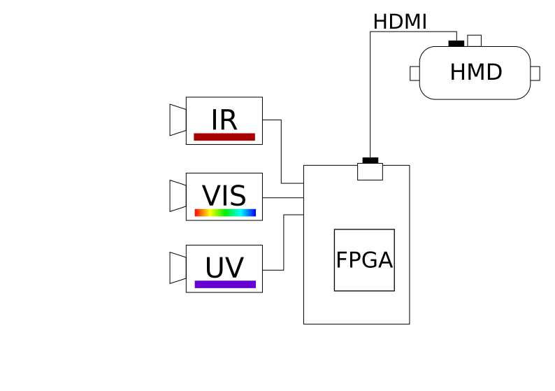
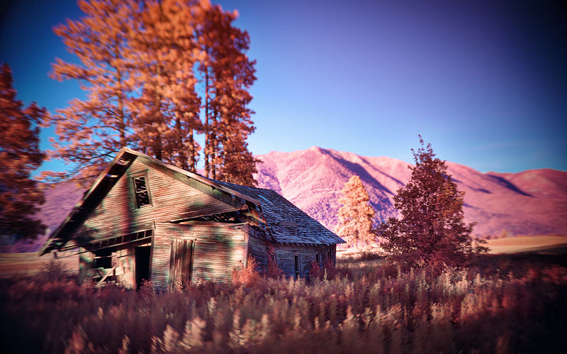

# Spectral Visor

The idea is to have (at least) 3 cameras working in different sections of EM spectrum. Images would be processed by FPGA (possibly with few presets). Final result would go to some kind of head mounted display, like HTC Vive or similar.

Main reason for this project is to be able to "see" images from infrared and ultraviolet cameras in real-time overlayed over normal image. Additionally using only visible spectrum camera one could simulate effects of  color deficiency.

Here is an image from Wikipedia user [Spigget](https://en.wikipedia.org/wiki/File:UV-Vis-IR_Homestead_in_Montana.jpg), illustrating how final result could look like.

Infrared is mapped to red, visible spectrum to green, and ultraviolet to blue.